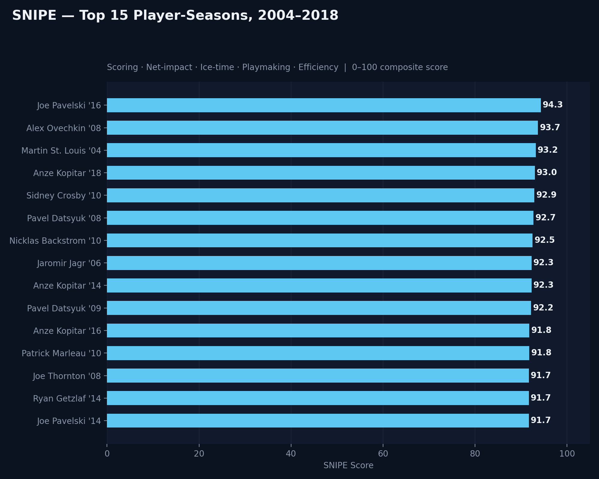
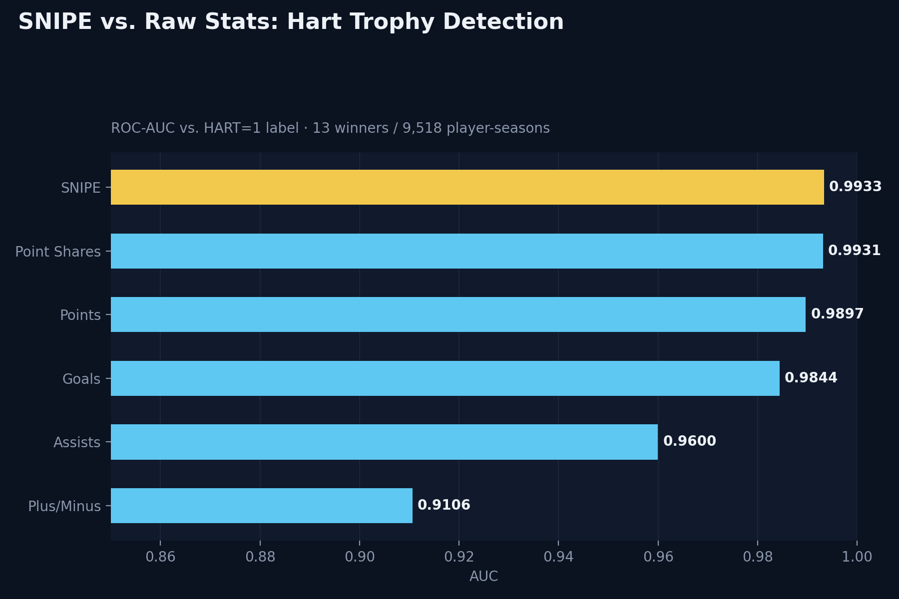
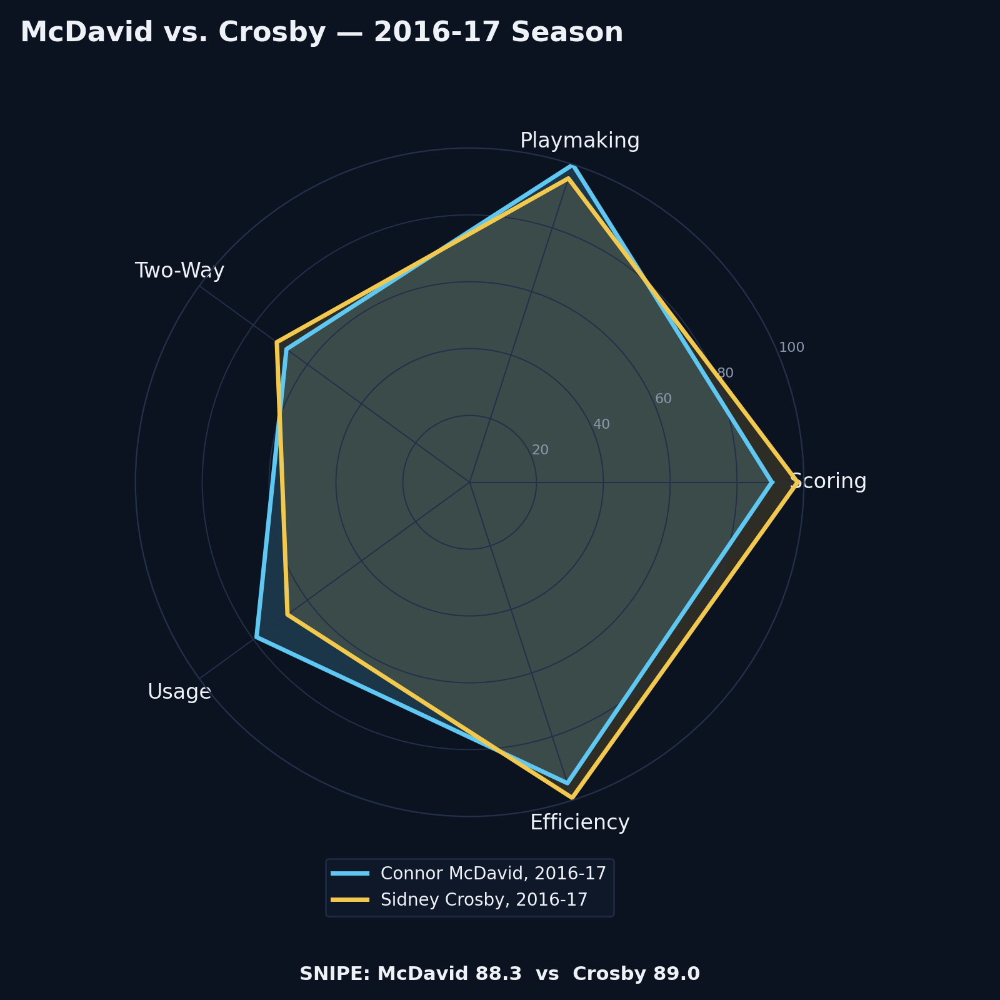
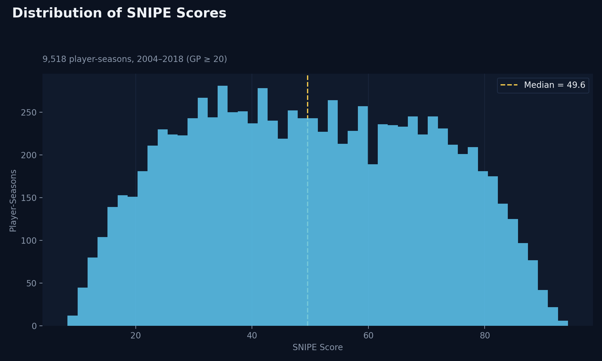
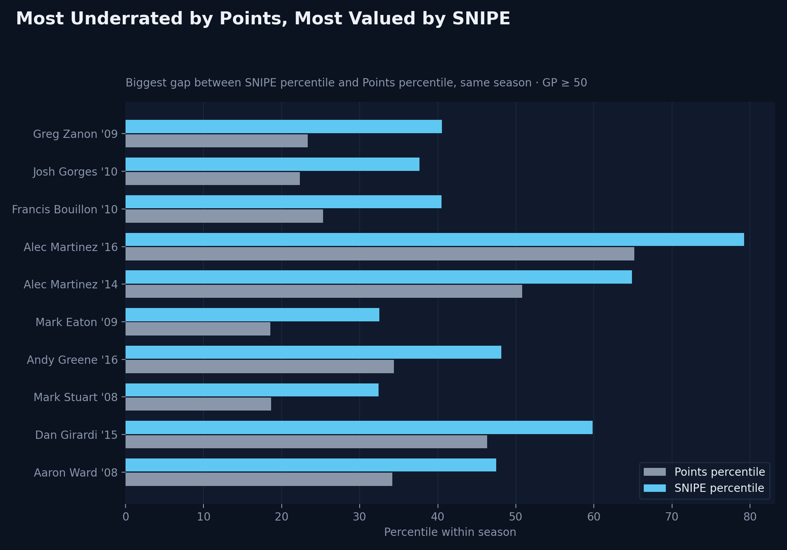

# SNIPE — NHL Player Impact Score

**S**coring · **N**et-impact · **I**ce-time (Usage) · **P**laymaking · **E**fficiency

A 0–100 composite score measuring how complete an NHL skater's season was — combining scoring, playmaking, two-way play, usage, and per-minute efficiency into one number, instead of ranking players on points alone.

> **Research question:** Does a multidimensional impact score identify elite/MVP-level players better than traditional point totals?

## Results

- **9,518 player-seasons** scored, 2004–2018 (skaters only, GP ≥ 20)
- SNIPE beats raw Points, Goals, Assists, and Plus/Minus at separating Hart Trophy winners from the field (AUC **0.9933** vs. 0.9897 for Points), and edges out Point Shares — a pre-built advanced stat — while SNIPE is built from five independent, inspectable dimensions instead of one black-box number
- The actual Hart winner landed in the SNIPE top-10 of their season **12 of 13 times** (median rank: 5th)
- All-time top 5: **Joe Pavelski '16, Alex Ovechkin '08, Martin St. Louis '04, Anze Kopitar '18, Sidney Crosby '10**

## How it works

For each stat, players are ranked into a **within-season percentile (0–100)** rather than compared on raw totals — this keeps scores comparable across a 2004–2018 span where league-wide scoring rates shifted. Percentiles are combined into five category scores, then weighted into the final SNIPE score:

| Category | Weight | Built from |
|---|---|---|
| Scoring | 30% | Goals, game-winners, shot volume, shooting %, power-play goals |
| Playmaking | 25% | Assists (even-strength, power-play) |
| Two-Way / Discipline | 15% | Plus/minus, blocks, hits, penalty minutes (inverted) |
| Usage | 15% | Time on ice, games played, faceoff % (centers only) |
| Efficiency | 15% | Points/GP, shooting %, points per 60 minutes |

Full formula and category math are in [`build_snipe.py`](build_snipe.py).

## Data quality fixes (the part that made this a real project, not a formula)

The source data ([Kaggle: NHL 2004–2018 Player Data](.)) has real quality issues that had to be resolved before any score could be trusted:

1. **2009 is stored differently than every other season.** Every other season (2004, 2006–2018) is pre-aggregated to one row per player. 2009 alone has team-split rows for traded players with **no combined total row** — and on top of that, a separate duplicate-entry bug where some players (e.g. Crosby) appear twice for the *same* team with two different stat lines. Both had to be identified and resolved before scores could be computed. See `rebuild_season()` in the script for the full logic and reasoning.
2. **No true possession metrics exist in this dataset** — no Corsi, Fenwick, xG, or on-ice shot differential. The "Usage" category uses TOI, faceoffs, and games played as the closest available proxies, not a substitute for real possession data.
3. **Faceoff % is centers-only.** Applying it to wingers/D would penalize them for a stat their role doesn't generate. Non-centers get a neutral 50 for that component instead.
4. **Point Shares (PS) is deliberately excluded** from the formula. It's already a compiled advanced stat — including it as an input and then validating against Hart voting (which correlates with PS) would be circular. It's used only as a comparison baseline in validation.
5. **2005 has no data** (NHL lockout season, no games played).
6. **Hart target is a 14-vs-13,172 class imbalance.** Evaluated with AUC and top-k rank, not accuracy.

## Files

| File | What it is |
|---|---|
| `build_snipe.py` | Full pipeline: data cleaning, category scoring, SNIPE composite, leaderboard export |
| `make_visuals.py` | Generates all PNGs in this repo |
| `snipe_leaderboard.csv` | All 9,518 scored player-seasons, sorted by SNIPE |
| `snipe_full_dataset.csv` | Full working dataset with all intermediate percentile/category columns |

## Not yet done

- Formal weight sensitivity testing (current weights are a reasoned starting point, not optimized)
- Interactive player-comparison tool (static radar chart above is a proof of concept)
- Positional sub-rankings (forwards vs. defensemen use different skill profiles)
